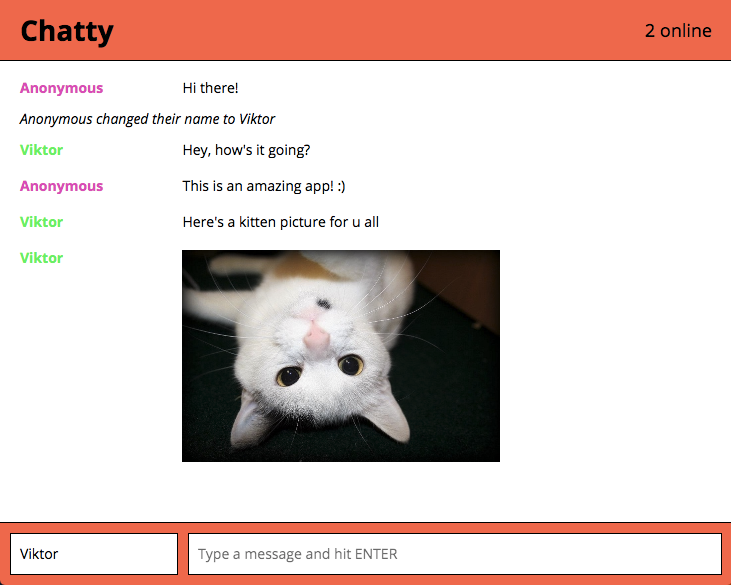

Chatty App
=====================
Small chat app built as an exercise in Web Sockets and React. Back end server is located in chatty-server repo.

### Demo

http://viktmv.github.io/chatty/

### Overview



### Usage

Install the dependencies and start the server.

```
npm install
npm start
open http://localhost:3000
```
### Web socket server located at

`https://github.com/viktmv/chatty-server`

### Dependencies

* React
* Webpack
* [babel-loader](https://github.com/babel/babel-loader)
* [webpack-dev-server](https://github.com/webpack/webpack-dev-server)

For full list of dependencies check out package.json
